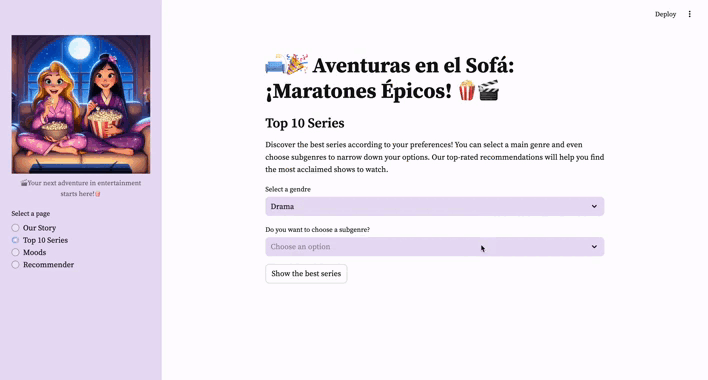

# 🛋️🎉 **Aventuras en el Sofá: ¡Maratones Épicos!** 🍿🎬

## Descripción

¿Estás cansado de pasar más tiempo buscando buen contenido que viéndolo? Aquí te traigo la solución: recibe recomendaciones de contenido según tu **mood** 😃, el género que más te guste 🎥 o basado en una descripción, título o actor 🎞️. 

Este proyecto es mi proyecto final en **Ironhack** como analista/científico de datos 🎓, donde he creado una app en **Streamlit** utilizando todos los conocimientos adquiridos en **limpieza de datos**, **manipulación de datos** y **machine learning**. 

### Contexto

En este proyecto se utiliza un dataset sobre contenido audiovisual de **IMDb** 🎬, para crear una app en **Streamlit** que recomiende películas 🎞️, series 📺, o videojuegos 🎮. Se ha realizado limpieza de datos, se han generado vectores con **Pinecone** 🍍, para la comprensión del lenguaje, y se ha creado la propia app.

## Estructura del Proyecto

- **data/**: Carpeta que contiene todos los CSV 📂 y una subcarpeta llamada **clean_data** con el CSV que se va a utilizar (`series.csv`).
- **.streamlit/**: Carpeta que contiene el archivo `config.toml`.
- **notebooks/**: 
  - `main.ipynb`: Limpieza de datos y resultados finales con conclusiones 📝.
  - `main_test.ipynb`: Pruebas iniciales y exploración de datos 🔍.
  - `functions.py`: Archivo que contiene funciones auxiliares utilizadas en los notebooks.
  - `embedding.ipynb`: Generación de embeddings para la comprensión del lenguaje.
  - `pinecone_setup.ipynb`: Configuración inicial de Pinecone.
- **resources/**: Carpeta que contiene fotos o GIFs 🖼️.
- **app.py**: Archivo principal para ejecutar la aplicación de Streamlit.
- **requirements.txt**: Lista de dependencias necesarias para el proyecto 📦.
- **config.yaml**: Archivo de configuración.

## Funcionalidades de la App

- **Recomendaciones en base a sinopsis** 📖.
- **Recomendaciones basadas en tu mood** 😊.
- **Búsqueda por género y subgénero favorito** ✨.
- **Recomendaciones basadas en tu actor/actriz favorito** 🌟.
- **Buscar contenido similar a un título** 🔍.
- **Rating disponible** ⭐ para que tengas en cuenta la opinión del público.

## Links de Interés

- [Link del Dataset en Kaggle](https://www.kaggle.com/datasets/suraj520/imdb-tv-series-data/data)
- [Presentación del proyecto](https://www.canva.com/design/DAGUeh4_aBw/mdwdKWdZKoXnLKR8M4q6vA/view?utm_content=DAGUeh4_aBw&utm_campaign=designshare&utm_medium=link&utm_source=editor)
- [Documentación de Pinecone](https://docs.pinecone.io/)
- [Streamlit Documentation](https://docs.streamlit.io/)

## Autora

- **Cristina Ramírez** 🌸

